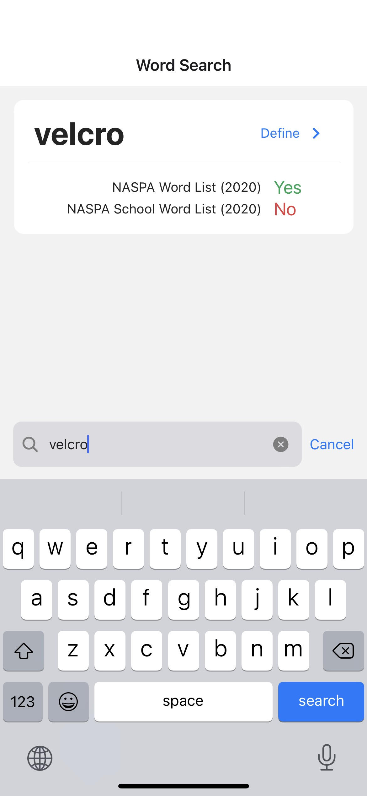
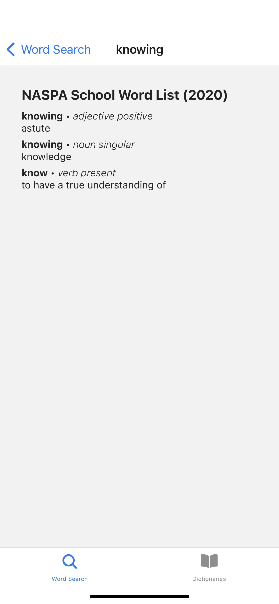
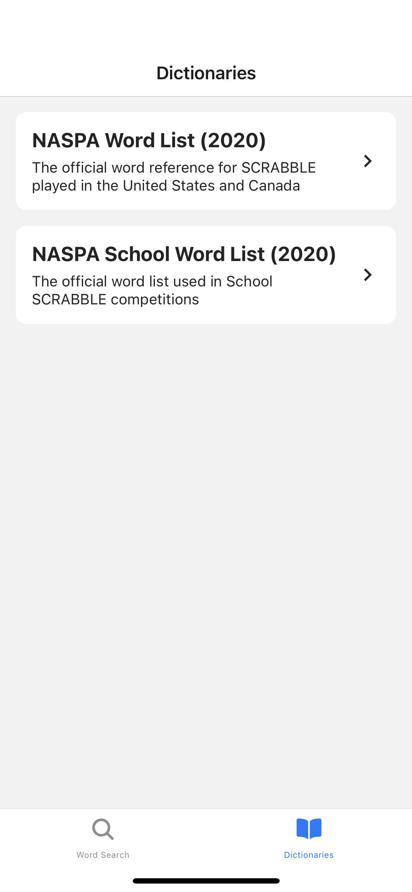
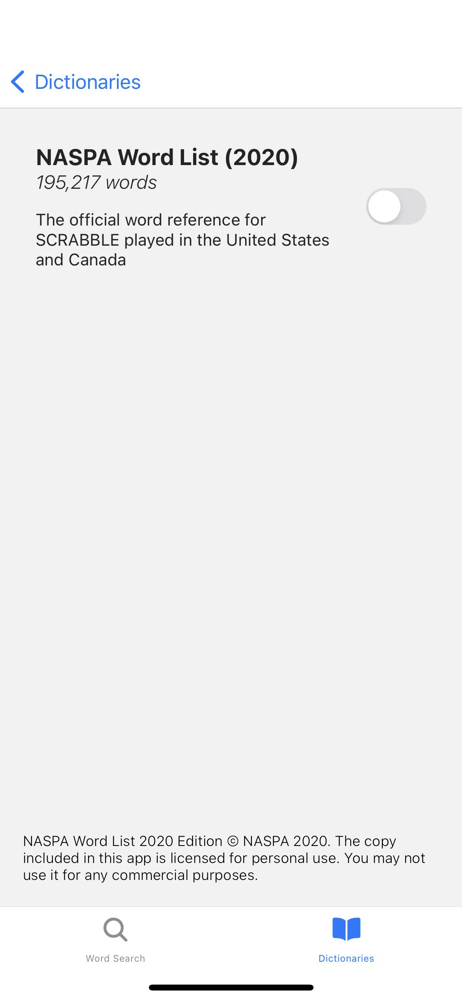

# Ka: Scrabble word search 

Ka is a Scrabble word search app for iPhone. The app includes the official NASPA Scrabble dictionaries: NASPA Word List (2020) and NASPA School Word List (2020).

|Search for words|View their definitions|
|:-:|:-:|
|||

|View list of dictionaries|Select dictionaries to include in word search|
|:-:|:-:|
|||

